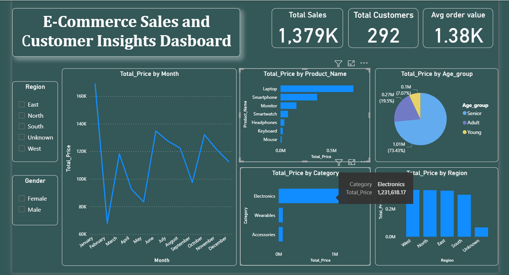

# E-Commerce Sales Analysis Dashboard
End-to-end e-commerce data analysis project using Excel, SQL, and Power BI with dashboard and insights.

## Project Overview
This project analyzes e-commerce sales data to understand customer behavior, product performance, and regional trends. The goal is to transform raw data into meaningful insights using Excel, SQL, and Power BI.

## Tools & Technologies
- Excel – Data Cleaning
- SQL – Data Analysis
- Power BI – Data Visualization

## Dataset Description
The dataset includes customer demographics, product details, and transaction data.

### Customer Data
- customer_id
- gender
- age
- region

### Product Data
- product_name
- category

### Sales Data
- unit_price
- quantity
- total_price
- shipping_fee

### Order Details
- shipping_status
- order_date

### Data Cleaning (Excel)
- Removed duplicates
- Handled missing values
- Standardized text (UPPER, TRIM)
- Fixed date formats
- Ensured correct data types.

## SQL Analysis
- Total revenue calculation
- Revenue by region
- Top-selling products
- Category-wise performance
- Monthly sales trends

## Dashboard (Power BI)
The dashboard includes:
- KPI cards (Total Sales, Customers, Avg Order Value)
- Monthly sales trend
- Product and category analysis
- Customer segmentation by age
- Region and gender filters

## Dashboard Preview

##  Key Insights
* Electronics category generated the highest revenue
* Adult age group contributed the most sales
* West region showed strong performance compared to others
* Monthly sales trend indicates fluctuations in demand
* Majority of orders were successfully delivered

## Business Impact

This analysis helps businesses understand customer purchasing behavior, identify top-performing products, and optimize sales strategies across different regions.
By analyzing sales trends and customer segments, companies can make data-driven decisions to improve revenue and customer satisfaction.

## Conclusion
In this project, I cleaned and analyzed e-commerce data using Excel, SQL, and Power BI. I created a dashboard to visualize sales trends, customer behavior, and product performance. This project helped me understand how to convert raw data into useful insights.

